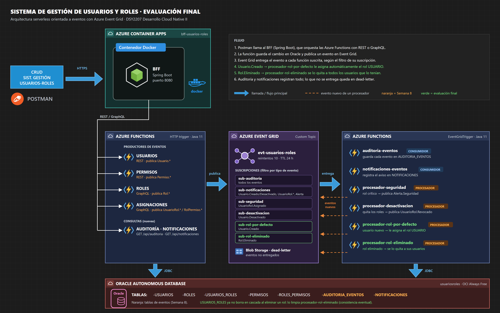

# Sistema de Gestión de Usuarios y Roles

DSY2207 Desarrollo Cloud Native II · Duoc UC

Backend cloud native para administrar usuarios, roles y permisos. Está compuesto por un **BFF en Spring Boot**, **funciones serverless en Java** sobre Azure Functions con APIs **REST y GraphQL**, una **arquitectura orientada a eventos con Azure Event Grid** y una base de datos **Oracle Autonomous Database**.

**Documentación de la evaluación final: [docs/semana9/README.md](docs/semana9/README.md)**

## Estructura

| Carpeta | Contenido |
|---|---|
| [`bff-springboot/`](bff-springboot) | Microservicio BFF (Spring Boot 2.7, Java 11) y su `Dockerfile` |
| [`azure-functions/`](azure-functions) | 13 funciones serverless en Java 11: productoras HTTP (REST y GraphQL), consumidoras y procesadoras de eventos, y pruebas unitarias |
| [`database/`](database) | Scripts de Oracle, que se ejecutan en orden: `usuarios_roles.sql`, `semana8_eventos.sql`, `semana9_eventos.sql` |
| [`infra/event-grid/`](infra/event-grid) | Script de Azure CLI que crea el topic y las suscripciones, y simulador local de Event Grid |
| [`docs/`](docs) | Documentación y diagramas de cada entrega (semanas 6, 8 y 9) y colección de Postman |

## Reglas de negocio con eventos

- **Al crear un usuario** se le asigna automáticamente el rol `USUARIO` (`procesador-rol-por-defecto`).
- **Al eliminar un rol** se les quita a todos los usuarios que lo tenían (`procesador-rol-eliminado`).
- **Auditoría** de todos los eventos y **notificaciones** a los usuarios afectados.
- **Alerta de seguridad** al asignar un rol crítico y **revocación de roles** al desactivar una cuenta.

## URLs desplegadas

- BFF: https://bff-usuarios-roles.politesmoke-8ab26d2c.eastus.azurecontainerapps.io
- Azure Functions: https://funcionusuariosroles1-hqasc7d7b2b2d9b9.eastus-01.azurewebsites.net/api
