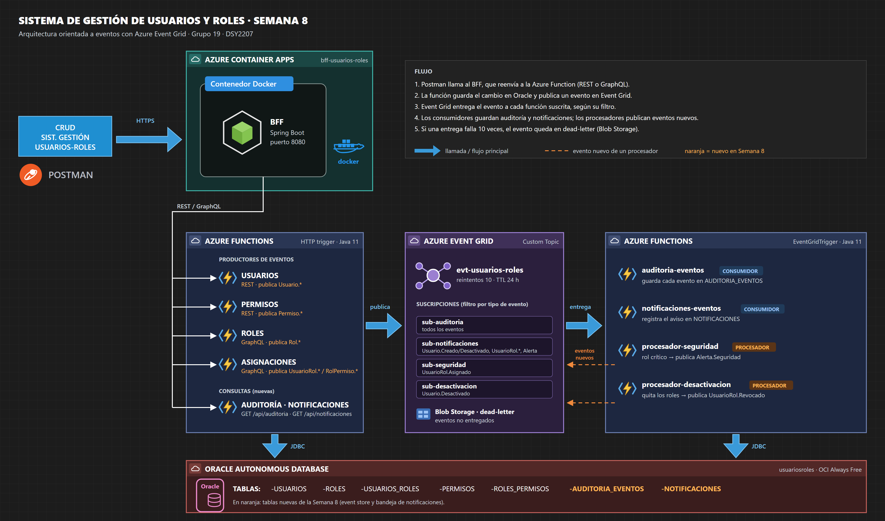

# Semana 8 — Azure Event Grid con funciones productoras y consumidoras

DSY2207 Desarrollo Cloud Native II · Actividad sumativa "Aplicando tecnologías de eventos en arquitecturas cloud" · Grupo 19 (Carlos Orrego – Alberto Diaz)

Esta semana se implementa la parte central del diseño orientado a eventos de la [Semana 6](../semana6/README.md). Las funciones serverless de las semanas anteriores pasan a **publicar eventos** en un Custom Topic de **Azure Event Grid**. Cuatro funciones Java nuevas con `@EventGridTrigger` los **consumen y procesan**.



## Qué se construyó

### Productores de eventos (funciones HTTP existentes)

Cada función publica el evento **después** de confirmar el cambio en Oracle, usando [EventGridPublisher](../../azure-functions/src/main/java/cl/duoc/usuariosroles/eventos/EventGridPublisher.java). El publicador llama a la API REST del topic con la clave `aeg-sas-key`. Si Event Grid falla, el error queda en los logs y la respuesta HTTP no cambia, porque el dato ya quedó guardado.

| Función | Eventos que publica | Subject |
|---|---|---|
| `usuarios` (REST) | `Usuario.Creado`, `Usuario.Actualizado`, `Usuario.Desactivado` (cuando el estado pasa de ACTIVO a INACTIVO), `Usuario.Eliminado` | `usuarios/{id}` |
| `permisos` (REST) | `Permiso.Creado`, `Permiso.Actualizado`, `Permiso.Eliminado` | `permisos/{id}` |
| `roles` (GraphQL) | `Rol.Creado`, `Rol.Actualizado`, `Rol.Eliminado` | `roles/{id}` |
| `asignaciones` (GraphQL) | `UsuarioRol.Asignado`, `UsuarioRol.Revocado`, `RolPermiso.Asignado`, `RolPermiso.Revocado` | `usuarios/{id}` / `roles/{id}` |

Los eventos de usuario **nunca** incluyen la contraseña.

### Consumidores y procesadores (funciones nuevas con EventGridTrigger)

| Función | Tipo | Suscripción y filtro | Qué hace |
|---|---|---|---|
| `auditoria-eventos` | Consumidor | `sub-auditoria`: todos los eventos | Guarda cada evento sin modificarlo en `AUDITORIA_EVENTOS` (event store). Usa el id del evento como clave primaria, así un reintento no duplica el registro. |
| `notificaciones-eventos` | Consumidor | `sub-notificaciones`: `Usuario.Creado`, `Usuario.Desactivado`, `UsuarioRol.Asignado`, `UsuarioRol.Revocado`, `Alerta.Seguridad` | Arma el aviso (bienvenida, rol asignado o quitado, cuenta desactivada, alerta) y lo registra en `NOTIFICACIONES`. |
| `procesador-seguridad` | Procesador | `sub-seguridad`: `UsuarioRol.Asignado` | Si el rol asignado es crítico (`ROLES_CRITICOS`, por defecto `ADMINISTRADOR`), **publica** `Alerta.Seguridad`. |
| `procesador-desactivacion` | Procesador | `sub-desactivacion`: `Usuario.Desactivado` | Borra en una transacción todos los roles del usuario en `USUARIOS_ROLES` y **publica** un `UsuarioRol.Revocado` por cada uno (motivo `USUARIO_DESACTIVADO`). |

Los **procesadores** ejecutan lógica de negocio y generan eventos nuevos. Los **consumidores** hacen una acción final (guardar o notificar) y no publican nada. Así se evitan ciclos: ningún procesador escucha los eventos que él mismo publica.

### Consultas (HTTP)

`ConsultasEventosFunction` muestra lo que registraron los consumidores. También está disponible a través del BFF:

- `GET /api/auditoria?subject=usuarios/7&tipo=Usuario.Creado&limite=50`
- `GET /api/notificaciones?destinatario=ana@empresa.cl&limite=50`

### Confiabilidad

- **Reintentos:** si una función consumidora falla (por ejemplo, Oracle no responde), lanza la excepción y Event Grid reintenta la entrega hasta 10 veces durante 24 horas.
- **Dead-letter:** los eventos que agotan los reintentos quedan en el contenedor `eventos-deadletter` del Storage de la Function App.
- **Idempotencia:** auditoría y notificaciones ignoran un evento que ya registraron. La desactivación no publica nada la segunda vez, porque el usuario ya no tiene roles.

## Ejecutar en local

Sin Azure, el topic se reemplaza por [simulador-local.js](../../infra/event-grid/simulador-local.js). El simulador recibe los eventos con el mismo formato y la misma clave que el topic real, y los entrega a las funciones locales con los mismos filtros de las 4 suscripciones.

En `azure-functions/local.settings.json` (no se sube a git) hay que tener:

```json
"EVENTGRID_TOPIC_ENDPOINT": "http://localhost:7199/api/events",
"EVENTGRID_TOPIC_KEY": "clave-local"
```

Hacen falta 4 terminales, todas en la raíz del repositorio:

| # | Proceso | Comando |
|---|---|---|
| 1 | Azurite (storage local de Functions) | `azurite --silent --location .azurite` |
| 2 | Simulador de Event Grid | `node infra/event-grid/simulador-local.js` |
| 3 | Azure Functions (puerto 7071) | `cd azure-functions` y luego `mvn clean package azure-functions:run` |
| 4 | BFF (puerto 8080) | `cd bff-springboot` y luego `mvn spring-boot:run` |

Las Functions estarán listas cuando la terminal 3 muestre la lista de 11 funciones. Desde ahí se usan las mismas llamadas del guion de abajo contra `http://localhost:8080`. En la terminal 2 se ve en vivo cada evento publicado y a qué funciones se entregó.

## Despliegue

Orden: base de datos → funciones → Event Grid → BFF.

**1. Tablas nuevas en Oracle.** Ejecutar [database/semana8_eventos.sql](../../database/semana8_eventos.sql) en Database Actions / SQL Developer, con el mismo usuario de las tablas existentes.

**2. Funciones en Azure.** Mismo proceso de la Semana 5:

```bash
cd azure-functions
mvn clean package azure-functions:deploy
```

Al terminar, la Function App `funcionusuariosroles1` debe listar 11 funciones: `usuarios`, `permisos`, `roles`, `asignaciones`, `auditoria`, `notificaciones`, `auditoria-eventos`, `notificaciones-eventos`, `procesador-seguridad`, `procesador-desactivacion` y `probar-conexion-oracle`.

**3. Event Grid.** Abrir **Azure Cloud Shell (Bash)** desde el portal y ejecutar:

```bash
git clone https://github.com/carlos2211/sistema-usuarios-roles-cloud.git
cd sistema-usuarios-roles-cloud
bash infra/event-grid/configurar-event-grid.sh
```

El script ([configurar-event-grid.sh](../../infra/event-grid/configurar-event-grid.sh)) hace lo siguiente:

- Crea el topic `evt-usuarios-roles`.
- Carga `EVENTGRID_TOPIC_ENDPOINT`, `EVENTGRID_TOPIC_KEY`, `ROLES_CRITICOS` y `SEGURIDAD_CORREO` en la Function App.
- Crea el contenedor de dead-letter.
- Crea las 4 suscripciones con sus filtros.

Se puede volver a ejecutar sin problemas. Los valores por defecto (grupo `prueba_funcion`, región `eastus`) se cambian con variables, por ejemplo `RESOURCE_GROUP=otro bash infra/...`.

**4. BFF.** Reconstruir la imagen, porque tiene las rutas nuevas, y apuntarla a la Function App:

```bash
cd bff-springboot
mvn clean package
docker build -t usuarios-roles-bff .
docker run -p 8080:8080 -e AZURE_FUNCTIONS_BASE_URL=https://funcionusuariosroles1.azurewebsites.net/api usuarios-roles-bff
```

## Guion de la demostración (video)

Todas las llamadas van al BFF (`http://localhost:8080` o la URL de Docker Lab). Event Grid entrega los eventos de forma asíncrona: entre una acción y su consulta conviene esperar 2 o 3 segundos.

**1. Crear un usuario → bienvenida + auditoría**

```http
POST /api/usuarios
{"nombre":"Ana","apellido":"Rojas","correo":"ana.rojas@empresa.cl","contrasena":"Clave123"}
```

La respuesta trae `idUsuario` (por ejemplo, 7). Luego:

- `GET /api/auditoria?subject=usuarios/7` → aparece `Usuario.Creado`
- `GET /api/notificaciones?destinatario=ana.rojas@empresa.cl` → aparece el correo de bienvenida

**2. Asignar un rol crítico → procesador de seguridad**

```http
POST /api/asignaciones
{"query":"mutation { asignarRolAUsuario(idUsuario: 7, idRol: 1) { idUsuario idRol fechaAsignacion } }"}
```

El rol 1 es `ADMINISTRADOR` en los datos iniciales. Luego:

- `GET /api/auditoria?subject=usuarios/7` → `UsuarioRol.Asignado` y luego `Alerta.Seguridad`, generada por el procesador
- `GET /api/notificaciones` → "Se te asignó el rol ADMINISTRADOR" para Ana y "[Alerta de seguridad] ROL_CRITICO" para `seguridad@empresa.cl`

Si se asigna `SUPERVISOR` (idRol 2) no hay alerta. Sirve para mostrar el filtro de la regla.

**3. Desactivar el usuario → procesador de desactivación (cadena de eventos)**

```http
PUT /api/usuarios/7
{"nombre":"Ana","apellido":"Rojas","correo":"ana.rojas@empresa.cl","estado":"INACTIVO"}
```

Luego:

- `GET /api/auditoria?subject=usuarios/7` → `Usuario.Desactivado` y un `UsuarioRol.Revocado` por cada rol, con `motivo: USUARIO_DESACTIVADO`
- `POST /api/asignaciones` con `{"query":"{ rolesDeUsuario(idUsuario: 7) { nombre } }"}` → lista vacía
- `GET /api/notificaciones?destinatario=ana.rojas@empresa.cl` → "Tu cuenta fue desactivada" (un único aviso, no uno por rol)

**4. En el portal de Azure**

- **Event Grid topic `evt-usuarios-roles` → Métricas:** *Published Events* y *Matched Events*.
- **Suscripciones:** los filtros por tipo de evento de cada una.
- **Function App → cada función → Monitor:** las invocaciones disparadas por Event Grid.

## Pruebas automáticas

```bash
cd azure-functions
mvn test
```

Hay 13 pruebas que no necesitan Azure ni Oracle:

- El envío a Event Grid, contra un servidor HTTP local que imita el topic: clave, formato y manejo de errores.
- La lectura de eventos en el formato que entrega Event Grid.
- Las reglas de notificaciones y de roles críticos.
